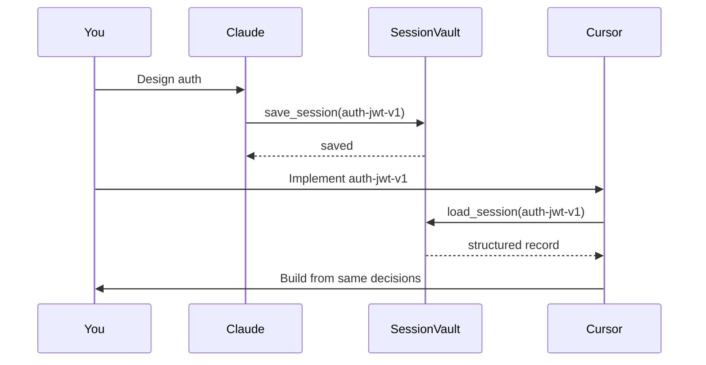
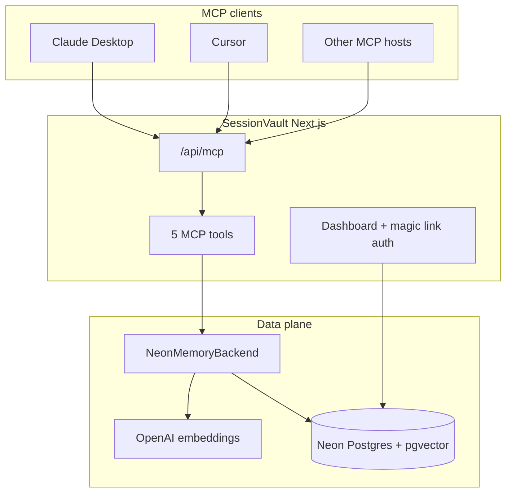
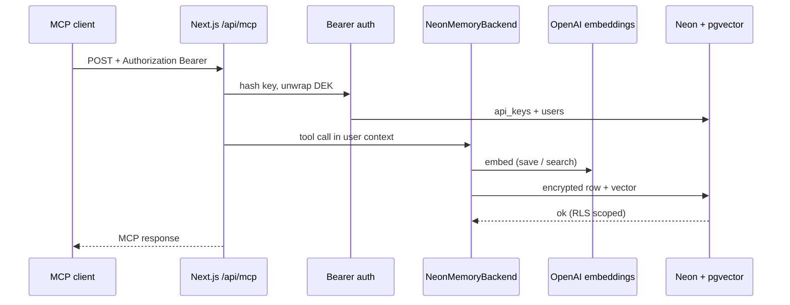

# How I gave my AI tools a shared memory using MCP and pgvector

Most AI memory products attach memory to one tool. That misses the real pain: handoff.

I plan in Claude, build in Cursor, and sometimes debug elsewhere. Every switch means re-pasting the plan, the file list, the decisions, and what already failed. Longer context windows do not fix that. Shared storage does.

SessionVault is a production MCP SaaS that stores structured session context for any MCP-aware client. Save in one tool. Load in another.

This post is design-focused: the problems, the architecture, and the choices that keep load correct and multi-tenant safe.

## Problem

| Failure mode | Why it hurts |
|---|---|
| Context lives in one chat | Switching tools resets the work |
| Copy-paste handoff | Easy to drop decisions, files, failed attempts |
| "Memory" as raw chat | Expensive tokens, weak structure, hard to trust |
| Semantic load by name | Can return a *similar* session instead of the *exact* one |

Target: a small shared bus both AIs can read and write. Handoff is a tool call, not a paste.

## Workflow



Clients need MCP. Claude Desktop and Cursor work today. Any host that can call remote MCP with a bearer token works the same way.

## System design

### High level



Vectors live in Postgres via pgvector. No separate vector database product.

### What is stored

Not chat logs. Structured fields: `name`, `summary`, `decisions[]`, `files[]`, `todos[]`, `errors[]`, optional `repo`.

Small payloads. Exact load by name. Semantic search when the name is forgotten.

### Stack

| Layer | Choice |
|---|---|
| App | Next.js on Vercel |
| MCP | HTTP at `/api/mcp` |
| Storage | Neon + pgvector |
| Embeddings | OpenAI |
| Web auth | Magic-link cookie |
| Agent auth | Bearer `sv_live_...` |
| Isolation | Forced Postgres RLS |
| At-rest crypto | AES-256-GCM envelope |

### Request path



Web humans use the dashboard cookie to create and revoke keys. Agents never use that cookie. They only send `sv_live_...`.

## Design problems and decisions

### 1. Exact load must not use semantic search

**Problem:** Early `load_session` searched by similarity. Saving `auth-jwt-v1` could load a nearby session. Silent wrong answer.

**Design:** Load by exact `(user_id, name)`. Search by embedding only. Never silently return the wrong session.

### 2. Keep the serverless path thin

**Problem:** Heavy memory SDKs and native deps blow cold start and function size on Vercel.

**Design:** One encrypted row, one embedding call, parameterized upsert. No local LLM sidecar in production.

### 3. Multi-tenant leaks are a WHERE bug away

**Problem:** Forgetting `user_id = ?` in a query is a data breach.

**Design:** Forced Postgres RLS. Every user query runs in a transaction after `set_config('app.user_id', ...)`. Missing filters return zero rows.

### 4. DB dump must not yield plaintext sessions

**Problem:** Session text can include filenames, unreleased design choices, secrets in error strings.

**Design:** Envelope encryption. Master key in env. Per-user DEK wrapped in the DB. Content stored as ciphertext + nonce. Embeddings stay searchable; content stays opaque without the master key.

### 5. Agent auth is not browser auth

**Problem:** Cursor and Claude are not logged into your website.

**Design:** Two planes.

- Web: magic link to `HttpOnly` session cookie to manage keys
- MCP: `Authorization: Bearer sv_live_...` hashed in DB, revocable, rate-limited

## Tools

| Tool | Contract |
|---|---|
| `save_session` | Upsert structured session |
| `load_session` | Exact name lookup (`brief` / `normal` / `full`) |
| `search_sessions` | Semantic search over embeddings |
| `list_sessions` | Newest-first list |
| `delete_session` | Delete by name |

```json
{
  "name": "auth-jwt-v1",
  "repo": "my-app",
  "summary": "JWT auth + bcrypt; replacing passport.js",
  "decisions": ["jsonwebtoken over passport.js", "bcrypt cost 12"],
  "files": ["src/auth.ts", "src/middleware.ts"],
  "todos": ["Add refresh token rotation"],
  "errors": []
}
```

## Try it

```bash
pnpm install
pnpm sv:generate-keys
DATABASE_URL=... pnpm sv:setup-db
pnpm dlx vercel
```

Sign in, create a key, then:

```json
{
  "mcpServers": {
    "sessionvault": {
      "url": "https://your-app.vercel.app/api/mcp",
      "headers": { "Authorization": "Bearer sv_live_..." }
    }
  }
}
```

Deeper references: `README.md`.

## Takeaway

For AI engineers the interesting layer is not a bigger context window. It is a shared, typed memory bus with clear contracts: exact load, semantic search, tenant isolation, and encryption at rest.

Plan in Claude. Build in Cursor. Skip the copy-paste.
